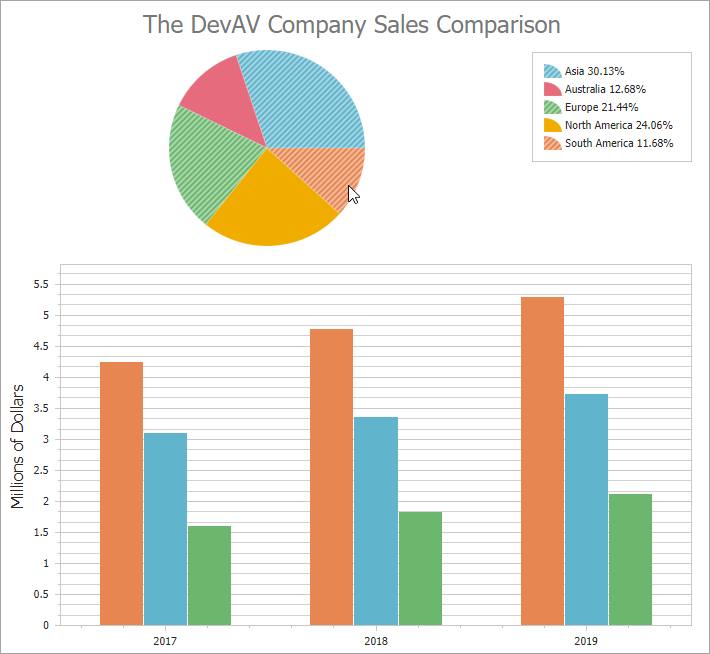

# How to Track Changes to the Collection of Chart Selected Items

Use the [WebChartControl.SelectedItemsChanged](https://docs.devexpress.com/AspNet/DevExpress.XtraCharts.Web.WebChartControl.SelectedItemsChanged) event to track changes to the collection of chart selected items.

In this example, the bar chart displays only points that correspond to the selected segments in the pie chart.

